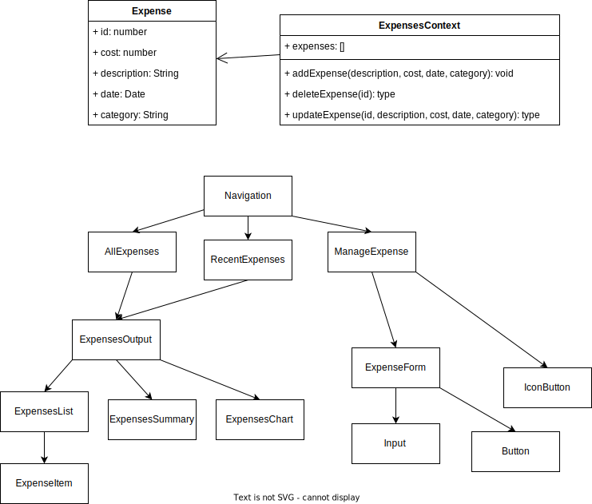

# ExpenseTracker app

This is the first assignment

## Class diagram

## User stories

[User stories](docs/userStories.md)

## Specifications

[Specifications](docs/specifications.md)

## Peer review

[Peer review](docs/peerReview.md)

## Screenshots

### All Expenses

### Recent Expenses

### Add Expense

### Edit Expense

