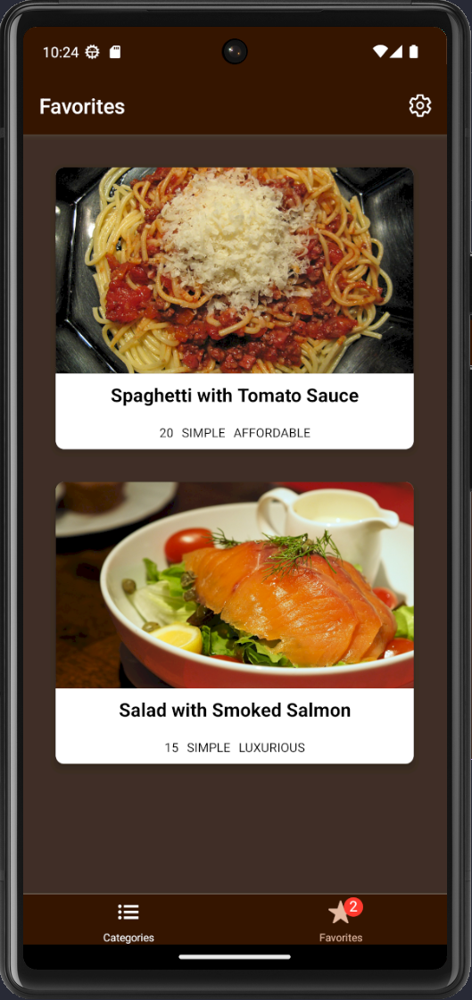
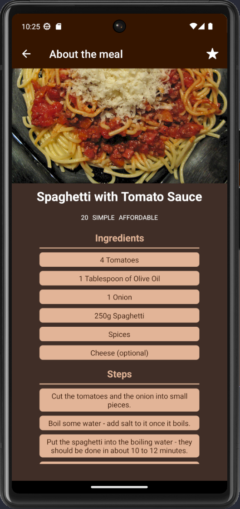

# Meals app

This is the second assignment

## Class diagram

## Use case diagram

## Specifications

[Specifications](docs/specifications.md)

## Peer review

[Peer review](docs/peerReview.md)

## Differences and additions

[Differences and additions](docs/differencesAndAdditions.md)

## Screenshots

### Categories

### Favorites

### Sinlge category (Quick and easy)

### Single meal (Spaghetti with tomato sauce)

### Settings (Filters)

